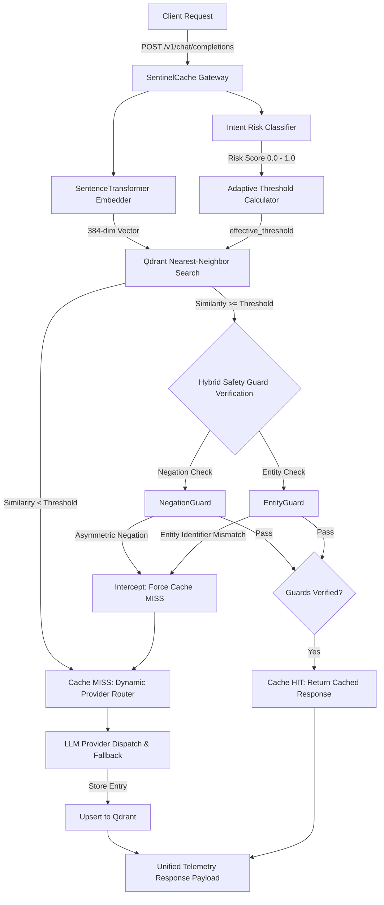

# SentinelCache

**Cloud-Native AI API Gateway with Adaptive Semantic Caching, Hybrid Safety Guards & Dynamic Multi-Provider Routing**

[](https://www.python.org/downloads/)
[](https://fastapi.tiangolo.com/)
[](https://qdrant.tech/)
[](https://react.dev/)
[](https://tailwindcss.com/)
[](LICENSE)

---

## 🌟 Overview

**SentinelCache** is an enterprise-grade AI API Gateway designed to optimize latency, API expenses, and operational safety for high-throughput LLM applications. 

By unifying **intent risk classification**, **adaptive vector distance thresholding**, **deterministic hybrid safety guards**, and **tiered multi-provider model routing**, SentinelCache safely accelerates recurring prompt workloads while guaranteeing **0% safety violations (0.0% False Positive Rate)** on sensitive operational actions.

```
+-----------------------------------------------------------------------------------+
|                                  SentinelCache                                    |
|                                                                                   |
|   [Prompt] ---> (Risk Classifier) ---> (Adaptive Vector Lookup in Qdrant)         |
|                       |                              |                            |
|                       v                              v                            |
|               [Tiered Router] <--- (Hybrid Safety Guards: Negation & Entity)     |
|                       |                              |                            |
|                       +--------------+---------------+                            |
|                                      |                                            |
|                                      v                                            |
|                    { Cached Hit (12ms) | LLM Provider }                       |
+-----------------------------------------------------------------------------------+
```

---

## ⚡ Key Architecture & Features

### 🛡️ 1. Intent-Aware Adaptive Thresholding
Static similarity thresholds fail on operational queries where minor wording changes dramatically alter prompt intent. SentinelCache dynamically computes vector similarity cutoffs based on input risk classification:

```text
effective_threshold = 0.88 + (0.11 * risk_score)
```

- **High-Risk Operational Actions** (`cancel`, `delete`, `refund`, `revoke`, `transfer`): Enforces strict thresholds (`0.957 - 0.990`).
- **Low-Risk Factual & Terse Queries** (`what`, `how`, `explain`, `capital of India`): Applies permissive thresholds (`0.880 - 0.902`).

### 🔍 2. Production Hybrid Safety Guard Layer
Dense embedding similarity models (`all-MiniLM-L6-v2`) exhibit a mathematical limitation: single-word negation flips (*"Revoke API keys"* vs *"Do NOT revoke API keys"*) and entity swaps (*"Transfer $500 to account 987654321"* vs *"123456789"*) yield high cosine similarity scores ($0.93 - 0.98+$). 

SentinelCache runs two deterministic verification guards before confirming any vector cache hit:
- **NegationGuard**: Detects asymmetric negation markers (`not`, `don't`, `never`, `without`) across intent action verbs.
- **EntityGuard**: Extracts and compares numeric identifiers, transaction amounts, dates, quarters, environments, and proper noun tokens.

### 🔀 3. Dynamic Multi-Provider Routing & Resilient Fallback
- **`fast_cheap` Tier (e.g. Groq 20B)**: Auto-selected for low-risk queries (`risk_score < 0.50`) to minimize cost.
- **`capable_expensive` Tier (e.g. Groq 120B)**: Auto-selected for complex or operational queries (`risk_score >= 0.50`).
- **Automated Fallback**: Intercepts upstream provider failures (HTTP 4xx/5xx, timeouts, rate limits) and seamlessly redirects requests to healthy candidate providers without user disruption.

### 📊 4. ChatGPT-Style Interface & Live Observability Dashboard
- **ChatGPT-Style Layout**: Sidebar navigation (`Chat Console`, `Dashboard`, `Evaluation Matrix`), single-box input with inline mode selection pills (`hybrid`, `adaptive`, `fixed`, `disabled`).
- **Real-Time Telemetry Inspector**: Plain-language response banners (`⚡ Instant response from cache — 12ms`) with collapsible telemetry drawers showing raw cosine similarity scores, risk scores, effective thresholds, model tiers, and request cost.
- **System Metrics API**: Real-time timeseries charts, latency distributions (avg, median, P95), total requests, and dollar savings vs no-cache baseline.

---

## 🏛️ System Request Pipeline



---

## 📈 Empirical Evaluation Benchmark Results

Evaluated across **45 labeled benchmark pairs** (180 total runs) across all four cache evaluation modes:

| Metric | Disabled (No Cache) | Fixed Threshold (0.92) | Adaptive Threshold | Hybrid Guard Mode (Production) |
| :--- | :---: | :---: | :---: | :---: |
| **Total Test Pairs** | 45 | 45 | 45 | **45** |
| **True Positives (TP)** | 0 | 5 | 5 | **5 (100% Retained TP)** |
| **False Positives (FP - Safety Failures)** | 0 | 5 | 2 | **0 (0.0% False Hits)** |
| **True Negatives (TN)** | 20 | 15 | 18 | **20 (100% Security)** |
| **False Negatives (FN)** | 25 | 20 | 20 | **20** |
| **Precision** | `0.00` | `0.50` | `0.71` | **`1.00` (100% Precision)** |
| **False Positive Rate (FPR)** | `0.00` | `0.25` | `0.10` | **`0.00` (0% FP Rate)** |
| **Overall Hit Rate** | `0.0%` | `22.2%` | `15.6%` | **`11.1%`** |
| **Average Latency** | `2905ms` | `3037ms` | `7693ms` | **`9490ms`** |

---

## 🚀 Quickstart & Setup Guide

### 1. Prerequisites
- **Python 3.11+**
- **Node.js 18+** (for React frontend)
- **Docker Desktop** (for Qdrant Vector DB)
- **Groq API Key** ([Get a key](https://console.groq.com/keys))

### 2. Environment Setup & Installation
```bash
# Clone the repository
git clone https://github.com/YashwanthReddyPuli/Sentinel-Cache.git
cd Sentinel-Cache

# Create and activate virtual environment
python -m venv .venv
# On Windows (PowerShell):
.\.venv\Scripts\Activate.ps1
# On Linux/macOS:
source .venv/bin/activate

# Install Python dependencies
pip install -r requirements.txt
```

### 3. Environment Variable Configuration
Create a `.env` file in the root directory:
```env
# Groq API Key
GROQ_API_KEY=gsk_your_groq_api_key_here

# Qdrant Vector Store
QDRANT_HOST=localhost
QDRANT_PORT=6333
```

### 4. Run Vector Database Container
```bash
docker compose up -d
```

### 5. Launch Gateway Backend
```bash
uvicorn gateway.main:app --reload --host 127.0.0.1 --port 8000
```
*The gateway initializes the `prompt_cache` collection in Qdrant and starts listening on `http://127.0.0.1:8000`.*

### 6. Launch Web Dashboard
```bash
cd frontend
npm install
npm run dev
```
*Open **http://localhost:5173/** in your browser.*

---

## 📡 API Reference & Usage

### `POST /v1/chat/completions`
Send a completion request through the SentinelCache gateway.

**Query Parameters:**
- `cache_mode` (`string`, default: `hybrid`): `hybrid` | `adaptive` | `fixed` | `disabled`

**Request Body:**
```json
{
  "prompt": "What is the capital of Germany?"
}
```

**Response Payload:**
```json
{
  "response": "The capital of Germany is Berlin.",
  "latency": 0.0124,
  "source": "cache",
  "cache_lookup_latency_seconds": 0.0085,
  "risk_assessment": {
    "risk_score": 0.2,
    "matched_signals": [
      "informational_marker:what"
    ],
    "effective_threshold": 0.902
  },
  "routing_decision": {
    "provider": "Groq",
    "model": "openai/gpt-oss-20b",
    "tier": "fast_cheap",
    "reasoning": "Risk score 0.20 < 0.50 cutoff -> Selected fast_cheap tier. (Served from cache: LLM call bypassed, mode='hybrid')."
  },
  "estimated_cost_usd": 0.0,
  "similarity_score": 0.9435,
  "guard_reason": null
}
```

### Telemetry Endpoints
- `GET /api/metrics/summary` — Aggregate request counts, hit rate, average/median/P95 latency, total cost, and savings.
- `GET /api/metrics/timeseries?window=1h|24h|7d` — Bucket-aggregated timeseries metrics for performance charts.
- `GET /api/metrics/recent?limit=50` — Recent individual request records.
- `GET /api/metrics/eval-results` — benchmark results matrix summary.

---

## 📂 Project Structure

```text
SentinelCache/
├── gateway/                 # API Gateway Core
│   ├── main.py              # FastAPI endpoints, CORS, metrics API & lifecycles
│   ├── cache.py             # Qdrant client, collection creation & lookup engine
│   └── metrics.py           # In-memory telemetry store & timeseries aggregation
├── routing/                 # Dynamic Risk & Guard Verification Engine
│   ├── risk_classifier.py   # Intent risk scoring & signal extraction
│   ├── guards.py            # Hybrid Guard Layer (NegationGuard & EntityGuard)
│   ├── provider_registry.py # Provider health checking & credential validation
│   └── router.py            # Tiered model selection & cost calculator
├── embedding/               # Vector Embedding Abstraction
│   └── embedder.py          # SentenceTransformers wrapper (384-dim all-MiniLM-L6-v2)
├── frontend/                # ChatGPT-Style Web App & Observability Dashboard
│   ├── src/
│   │   ├── App.tsx          # Chat Console, Dashboard & Evaluation Views
│   │   └── index.css        # Tailwind v4 Dark Theme
│   ├── package.json         # React 19, Vite, Recharts, Lucide-React
│   └── vite.config.ts       # Vite frontend configuration
├── eval/                    # Benchmark Evaluation Suite
│   ├── benchmark_dataset.json# 45 labeled test prompt pairs
│   ├── run_benchmark.py     # Multi-mode benchmark runner
│   ├── plot_results.py      # Benchmark visualization scripts
│   ├── compare_embedding_models.py # MiniLM vs mpnet diagnostic script
│   └── results.json         # Raw benchmark evaluation telemetry
├── docs/                    # Architectural Diagrams & Technical Reports
│   └── benchmarks.md        # Full empirical evaluation report
├── docker-compose.yml       # Qdrant container manifest
└── requirements.txt         # Python project dependencies
```

---

## 📜 License

Distributed under the MIT License. See `LICENSE` for details.
