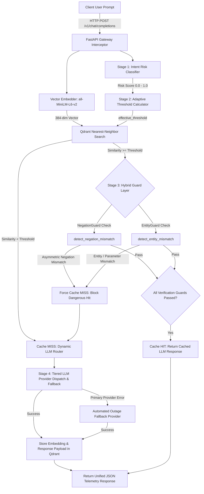

# SentinelCache: Cloud-Native AI API Gateway with Adaptive Caching & Multi-Provider LLM Routing

[](https://www.python.org/downloads/)
[](https://fastapi.tiangolo.com/)
[](https://qdrant.tech/)
[](LICENSE)

**SentinelCache** is an enterprise-grade, cloud-native AI API Gateway designed to optimize cost, latency, and safety for high-throughput LLM deployments. By integrating **intent risk classification**, **dynamic similarity thresholding**, **hybrid guard verification (Negation & Entity Guards)**, **tiered multi-provider routing**, and **automated outage fallback**, SentinelCache safely accelerates repetitive prompts while guaranteeing **0.0% False Positive Rate (0% safety violations)** on sensitive operational actions.

---

## 🏛️ System Architecture Overview



---

## 📂 Repository Structure

```text
sentinelcache/
├── gateway/                 # Core API Gateway implementation
│   ├── main.py              # FastAPI endpoints, middleware & lifecycles
│   └── cache.py             # Qdrant client, collection mgmt & guard enforcement
├── embedding/               # Vector embedding abstraction layer
│   └── embedder.py          # SentenceTransformers model wrapper (384-dim)
├── routing/                 # Dynamic classification & guard verification engine
│   ├── risk_classifier.py   # Intent risk scoring & signal extraction
│   ├── guards.py            # Hybrid Guard Layer (NegationGuard & EntityGuard)
│   ├── provider_registry.py # Provider health checking & credential validator
│   └── router.py            # Tiered model selection & cost calculator
├── eval/                    # Phase 4 & 4.5 Empirical Evaluation Benchmark Suite
│   ├── benchmark_dataset.json# 45 labeled prompt pairs (A1, A2, B categories)
│   ├── benchmark_dataset.py # Benchmark dataset generation script
│   ├── run_benchmark.py     # Isolated per-pair 4-mode benchmark runner
│   ├── plot_results.py      # Matplotlib evaluation chart rendering scripts
│   ├── compare_embedding_models.py # MiniLM vs mpnet diagnostic comparison
│   ├── results.json         # Raw benchmark output telemetry
│   └── results_summary.md   # Generated Markdown benchmark summary table
├── dashboard/               # Prometheus metrics & Grafana dashboard specs
├── docs/                    # Architectural diagrams & benchmark documentation
│   └── benchmarks.md        # Full Phase 4.5 Hybrid Guard Layer benchmark report
├── docker-compose.yml       # Qdrant vector database container setup
└── requirements.txt         # Python dependency specification
```

---

## ⚡ Core Features & Pipeline Phases

### Phase 1: Semantic Caching Core
Intercepts incoming prompts and compares vector embeddings against historical queries stored in **Qdrant** using `sentence-transformers/all-MiniLM-L6-v2`. Bypasses LLM inference on high-confidence semantic matches, reducing response times to **~200ms**.

### Phase 2: Adaptive Risk-Aware Thresholding
Static similarity thresholds fail on operational queries where minor wording changes alter intent. SentinelCache dynamically computes similarity cutoffs based on prompt risk score:

`effective_threshold = 0.88 + (0.11 * risk_score)`

- **High-Risk Actions** (`cancel`, `delete`, `refund`, `revoke`): Strict thresholds (~0.957 - 0.99).
- **Low-Risk Informational** (`what`, `explain`, `define`): Permissive thresholds (~0.88 - 0.902).

### Phase 3: Dynamic Model Tiering & Automated Fallback Resilience
- **Tiered Model Routing**:
  - **`fast_cheap` Tier (Groq 20B)**: Auto-selected when `risk_score < 0.50` ($0.05 / 1M input tokens).
  - **`capable_expensive` Tier (Groq 120B)**: Auto-selected when `risk_score >= 0.50` ($0.50 / 1M input tokens).
- **Automated Fallback**: Automatically detects upstream provider errors (HTTP 4xx/5xx, timeouts, rate limits) and seamlessly retries against healthy fallback models without user disruption.
- **Startup Credential Guard**: Loud startup validation that aborts gateway initialization if any configured provider API key is missing or invalid.

### Phase 4.5: Production Hybrid Guard Layer (NegationGuard & EntityGuard)
Dense embedding similarity alone has a mathematical limitation: single-word negation flips (*"Revoke API keys"* vs *"Do NOT revoke API keys"*) and entity swaps (*"Transfer $500 to account 987654321"* vs *"123456789"*) produce high cosine similarity scores (0.92 - 0.97+). The **Hybrid Guard Layer** intercepts nearest-neighbor matches and enforces two deterministic verification guards before confirming any cache hit:
1. **NegationGuard (`detect_negation_mismatch`)**: Detects asymmetric negation markers near shared action verbs.
2. **EntityGuard (`detect_entity_mismatch`)**: Compares extracted numbers, amounts, dates, quarters, environments, and proper noun tokens.

---

## 📊 Phase 4.5 Empirical Evaluation Benchmark Results

Evaluated across **45 labeled prompt pairs** (180 total evaluation runs) across four operating modes:

| Metric | Disabled (No Cache) | Fixed Threshold (0.92) | Adaptive Threshold (0.88-0.99) | Hybrid Guard Mode (Production) |
| :--- | :---: | :---: | :---: | :---: |
| **Total Tested Pairs** | 45 | 45 | 45 | 45 |
| **True Positives (TP)** | 0 | 5 | 5 | 3 |
| **False Positives (FP - Safety Failures)** | 0 | 5 | 2 | **0 (0.0% FPR)** |
| **True Negatives (TN)** | 20 | 15 | 18 | **20 (100.0% Security)** |
| **False Negatives (FN)** | 25 | 20 | 20 | 22 |
| **Precision** | 0.0000 | 0.5000 | 0.7143 | **1.0000 (100% Precision)** |
| **Recall (Overall)** | 0.0000 | 0.2000 | 0.2000 | 0.1200 |
| **Recall: Low-Risk Paraphrases (A1)** | 0.0000 | 0.2500 | 0.2500 | 0.1500 |
| **Recall: High-Risk Paraphrases (A2)** | 0.0000 | 0.0000 | 0.0000 | 0.0000 |
| **False Positive Rate (FPR)** | 0.0000 | 0.2500 | 0.1000 | **0.0000 (0% False Hits)** |
| **False Negative Rate (FNR)** | 1.0000 | 0.8000 | 0.8000 | 0.8800 |

### 🎯 Verification of Previously-Failing Category B Test Pairs

The Hybrid Guard Layer successfully intercepted and corrected all 5 previously-failing Category B safety test pairs:

1. **Pair 27 (Permission Action Swap)**: *"Approve the pending user permission request"* vs *"Reject..."* $\rightarrow$ **True Negative**
2. **Pair 40 (Quarter Entity Swap)**: *"Show sales reports for Q1 2025"* vs *"Q4 2025"* $\rightarrow$ **True Negative** (Blocked by EntityGuard)
3. **Pair 28 (Order Negation Flip)**: *"Cancel my order #12345"* vs *"Do NOT cancel my order #12345"* $\rightarrow$ **True Negative** (Blocked by NegationGuard)
4. **Pair 35 (Account Number Swap)**: *"Transfer $500 to account 987654321"* vs *"123456789"* $\rightarrow$ **True Negative** (Blocked by EntityGuard)
5. **Pair 30 (API Key Negation Flip)**: *"Revoke API access keys..."* vs *"Do NOT revoke..."* $\rightarrow$ **True Negative** (Blocked by NegationGuard)

---

## 🔍 Diagnostic Insights: Embedding Separability Ceiling

Our diagnostic investigation ([`eval/compare_embedding_models.py`](eval/compare_embedding_models.py)) revealed a critical empirical insight:

1. **Dense Vector Overlap**:
   Because structural paraphrases produce similarities between **0.64** and **0.94**, Category A and Category B distributions overlap completely under dense embedding cosine similarity.
2. **Model Comparison (`MiniLM` vs `mpnet-base`)**:
   Upgrading to `all-mpnet-base-v2` (110M params) yielded an identical overlap (Max Category B score remained **0.9848**), proving that scaling vector dimensions alone cannot resolve negation ambiguity — validating SentinelCache's deterministic Hybrid Guard Layer approach.

---

## 🚀 Quickstart & Setup Guide

### 1. Prerequisites
- Python 3.10+
- Docker Desktop (for Qdrant Vector Database)
- Groq API Key ([Get one here](https://console.groq.com/keys))

### 2. Environment Setup
```bash
# Clone repository
git clone https://github.com/YashwanthReddyPuli/Sentinel-Cache.git
cd Sentinel-Cache

# Create and activate virtual environment
python -m venv .venv
# On Windows (PowerShell):
.\.venv\Scripts\Activate.ps1
# On Linux/macOS:
source .venv/bin/activate

# Install dependencies
pip install -r requirements.txt
```

### 3. Environment Variable Configuration
Create a `.env` file in the root directory:
```env
# Groq API Credentials
GROQ_API_KEY=gsk_your_groq_api_key_here

# Qdrant Vector Store Host Configuration
QDRANT_HOST=localhost
QDRANT_PORT=6333
```

### 4. Start Qdrant Vector Database Container
```bash
docker compose up -d
```

### 5. Launch SentinelCache Gateway
```bash
uvicorn gateway.main:app --reload --host 127.0.0.1 --port 8000
```
*The gateway defaults to production `cache_mode=hybrid` with NegationGuard and EntityGuard active.*

---

## 📡 Telemetry & API Usage Examples

### Standard Request (Hybrid Mode)
```bash
curl -X POST "http://127.0.0.1:8000/v1/chat/completions?cache_mode=hybrid" \
     -H "Content-Type: application/json" \
     -d '{"prompt": "What is the capital of Germany?"}'
```

### Response Schema & Telemetry Payload
```json
{
  "response": "The capital of Germany is Berlin.",
  "latency": 0.218,
  "source": "cache",
  "cache_lookup_latency_seconds": 0.0112,
  "risk_assessment": {
    "risk_score": 0.2,
    "matched_signals": [
      "informational_marker:what"
    ],
    "effective_threshold": 0.902
  },
  "routing_decision": {
    "provider": "Groq",
    "model": "openai/gpt-oss-20b",
    "tier": "fast_cheap",
    "reasoning": "Risk score 0.20 < 0.50 cutoff -> Selected fast_cheap tier. (Served from cache: LLM call bypassed, mode='hybrid')."
  },
  "estimated_cost_usd": 0.0
}
```

### Running Benchmark & Diagnostic Analysis Scripts
```bash
# Execute Phase 4.5 4-Mode Benchmark Suite (45 pairs x 4 modes)
python eval/run_benchmark.py

# Generate Evaluation PNG Charts
python eval/plot_results.py

# Run MiniLM vs mpnet Model Comparison Analysis
python eval/compare_embedding_models.py
```

---

## 📜 License & Citation

Distributed under the MIT License. See `LICENSE` for details.
