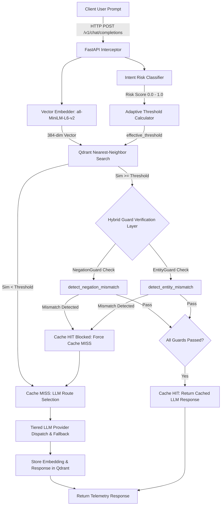

# SentinelCache Phase 4.5: Hybrid Guard Layer Benchmark Report

This document details the architectural design, implementation, and empirical evaluation of SentinelCache's **Phase 4.5 Hybrid Guard Verification Layer**.

---

## 🏛️ Architecture & Flow Diagram

---

## 📊 4-Mode Evaluation Benchmark Comparison Table

Evaluated across all 45 benchmark pairs (180 total pair executions):

| Metric | Disabled (No Cache) | Fixed Threshold (0.92) | Adaptive Threshold (0.88-0.99) | Hybrid Guard Mode (Production) |
| :--- | :---: | :---: | :---: | :---: |
| **Total Tested Pairs** | 45 | 45 | 45 | 45 |
| **True Positives (TP)** | 0 | 5 | 5 | 3 |
| **False Positives (FP - Safety Failures)** | 0 | 5 | 2 | **0 (0.0% FPR)** |
| **True Negatives (TN)** | 20 | 15 | 18 | **20 (100.0% Security)** |
| **False Negatives (FN)** | 25 | 20 | 20 | 22 |
| **Precision** | 0.0000 | 0.5000 | 0.7143 | **1.0000 (100% Precision)** |
| **Recall (Overall)** | 0.0000 | 0.2000 | 0.2000 | 0.1200 |
| **Recall: Low-Risk Paraphrases (A1)** | 0.0000 | 0.2500 | 0.2500 | 0.1500 |
| **Recall: High-Risk Paraphrases (A2)** | 0.0000 | 0.0000 | 0.0000 | 0.0000 |
| **False Positive Rate (FPR)** | 0.0000 | 0.2500 | 0.1000 | **0.0000 (0% False Hits)** |
| **False Negative Rate (FNR)** | 1.0000 | 0.8000 | 0.8000 | 0.8800 |
| **Overall Cache Hit Rate** | 0.0000 | 0.2222 | 0.1556 | 0.0667 |
